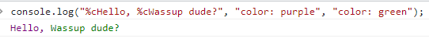

# Javascript's Important Notes

#### 1. Getting hexa value and octal value

```js
let hex = 0xff;
let oct = 0367;
console.log(hex, oct); // 255 247
```

#### 2. Lexiograph ordering system for here all small letter is getter than capital word

```js
let str = "a";
let str2 = "Z";
console.log(str > str2); // true
```

#### 3. Resizing an array

```js
const myArray = [2, 3, 4, 7, 8];
myArray.length = 2;
console.log({ myArray }); // { myArray: [ 2, 3 ] }
```

#### 4. Find the max Element of an array

```js
let maxElement = [3, 5, -1, 6.7, 0, -9, -2];
console.log(Math.max.apply(null, maxElement)); // 6.7
```

#### 5. Print inputs as a table

```js
class Person {
	constructor(firstName, lastName) {
		this.firstName = firstName;
		this.lastName = lastName;
	}
}
let family = {};
family.father = new Person("John", "Smith");
family.mother = new Person("Jane", "Smith");
family.daughter = new Person("Emily", "Smith");

console.table(family);
```

#### 6. Remove decimal partition

```js
console.log(19.6 | 0); // 19
console.log(919.6 | 0); // 919
```

#### 7. Promise, then and catch

```js
let billPaid = true;
const pay = new Promise((resolve, reject) => {
	billPaid ? resolve("Someone have paid the bill") : reject("You have to pay your damn bill");
});
pay.then(
	(information) => {
		console.log(information);
	},
	(curse) => {
		console.log(curse);
	}
).catch((err) => {
	console.log(err);
});

// if you reject the promise with new Error then you will no longer need to add a second param as callback for
// reject in then

const hasMeeting = false;
const meeting = new Promise((resolve, reject) => {
	if (!hasMeeting) {
		const newMeeting = {
			meetingName: "Blog",
			time: "2.3pm",
			date: "Today",
		};
		resolve(newMeeting);
	} else {
		reject(new Error("You Have a meeting"));
	}
});

meeting
	.then((result) => {
		console.log("Done: ", result);
	})
	.catch((err) => {
		console.error("You already have a meeting.", err);
	});
```

#### 8. Substitute of .map()

```js
const dog = [
	{ name: "Rio", age: 2 },
	{ name: "Mac", age: 2 },
	{ name: "Blu", age: 3 },
];

const dogsNames = Array.from(dog, ({ name }) => name);
// const dogsNames = dogs.map(({ name }) => name);
console.log(dogsNames);
// return Rio, Mac, Blu
```

#### 9. Assertion in javascript

```js
console.assert(typeof user == undefined, "Error loading user.");
```

#### 10. Upload images with new FileReader()

```js
const profilePicCng = document.getElementById("profilePicsFile");
profilePicCng.addEventListener("change", function () {
	let file = document.getElementById("profilePicsFile").files[0];
	let preview = document.getElementById("profilePics");
	let reader = new FileReader();

	reader.onloadend = function () {
		preview.src = reader.result;
	};

	if (file) {
		reader.readAsDataURL(file);
	} else {
		preview.src = "/images/default.jpg";
	}
});
```

#### 11. Object related methods (values(), entries())

```js
let user = {
	name: "Minhaz",
	age: 21,
	email: "minhaz@gmail.com",
	phone: "01232323232",
};

console.log(Object.values(user)); // [ 'Minhaz', 21, 'minhaz@gmail.com', '01232323232' ]
console.log(Object.entries(user)); // return a 2d array [[ 'name', 'Minhaz' ],[ 'age', 21 ],[ 'email', 'minhaz@gmail.com' ],[ 'phone', '01232323232' ]]
```

#### 12. Copy an object from another in immutable way

```js
let user = {
	name: "Minhaz",
};

let user2 = Object.entries({}, user);

user2.name = "Sharif";
console.log(user.name, user2.name); // Minhaz Sharif
```

#### 13. Copy an array from another in immutable way (spread operator)

```js
let arr = [1, 23, 45];
let arr2 = [...arr];
arr2[2] = 900;

console.log(arr2, arr); // [1, 23, 45] [1, 23, 900]
```

#### 14. Copy an array from another in immutable way

```js
let arr3 = [1, 23, 45];

let arr4 = Array.from(arr3);
arr4[2] = 900;

console.log(arr4, arr3); // [1, 23, 45] [1, 23, 900]
```

#### 15. Find the maximum value from an array

```js
let numbers = [3, 43, 4, 7, 63, 17, 89, 34, 6];

let maxValue = numbers.reduce((prev, curr) => {
	return Math.max(prev, curr);
});
console.log(maxValue); // 89
```

#### 16. Find element and thier index

```js
let numbers = [3, 43, 4, 7, 63, 17, 89, 34, 6];

let findNum = numbers.find(function (value) {
	return value === 89;
});
console.log(findNum); // 89

let findIndex = numbers.findIndex(function (value) {
	return value === 89;
});
console.log(findIndex); // 6
```

#### 17. Filter only the integer number

```js
let mainArr = [3, 5, 6.7, "rahim", true];

let filteredArr = mainArr.filter(function (value) {
	return typeof value === "number" && value % parseInt(value) === 0;
});
console.log(filteredArr); // [3, 5]
```

#### 18. Find the summation of all elements in an array

```js
let arr0 = [3, 5, -1, 6.7, 0, -9, -2];
let sumElement = arr0.reduce((prev, curr) => {
	return prev + curr;
}, 0);

console.log(sumElement.toFixed(2)); // 2.70
```

#### 19. Sorting an object base on the property value (age)

```js
const personObj = [
	{
		name: "Minhaz",
		age: 21,
	},
	{
		name: "Mz-xl",
		age: 300,
	},
	{
		name: "T-78",
		age: 129,
	},
];

let dsArr = personObj.sort((a, b) => {
	if (a.age > b.age) {
		return -1;
	} else if (a.age < b.age) {
		return 1;
	} else {
		return 0;
	}
});

console.log(dsArr);
```

#### 20. Usages of local storage

```js
localStorage.setItem("user", "Sharif md minhaz"); // set value
const value = localStorage.getItem("user"); // get value
console.log(value); // Sharif md minhaz

localStorage.setItem("user", "Sharif md minhazur rahman rabbi"); // update value
localStorage.removeItem("username"); // delete value pair
localStorage.clear(); // remove all local storage
```

#### 21. Usages of session storage

```js
sessionStorage.setItem("exam", "only 4 days");
sessionStorage.removeItem("exam");

const countries = ["bangladesh", "india", "pakistan", "nepal"];
sessionStorage.setItem("countries", JSON.stringify(countries));

const allCountry = sessionStorage.getItem("countries");
console.log(JSON.parse(allCountry));

const userInfo = {
	name: "minhaz",
	age: 21,
	email: "minhaz@gmail.com",
};

sessionStorage.setItem("userDetails", JSON.stringify(userInfo));
console.log("user details ", JSON.parse(sessionStorage.getItem("userDetails")));
```

#### 22. Usages of cookies

```js
document.cookie = "username=minhaz; expires=Thu, 01 Jan 2070 00:00:00 GMT";
console.log("username is: ", document.cookie);
```

#### 23. Get the max value of an array with Math.max.apply(null, [1,2,3]) also it's equivalent to Math.max(1,2,3)

```js
let ranArr = [3, 03, 3, 5, 12, 67];
function getMaxValue(arr) {
	return Math.max.apply(null, arr);
}

console.log(getMaxValue(ranArr)); // 67
```

#### 24. Understanding every() function

```js
let dArr = [3, 9, 7, 3, 1, 5];

// every elements is odd so it will return true
console.log(
	dArr.every(function (value) {
		return value % 2 === 1;
	})
); // true
```

#### 25. Simple recursive funtion

```js
function demo(n) {
	if (n > 0) {
		console.log(`Iteration is irritating...`);
		demo(n - 1);
	} else return 0;
}

demo(10);
```

#### 26. Currying function example

```js
function currying(num1) {
	return function (num2) {
		return function (num3) {
			return num1 + num2 + num3;
		};
	};
}

console.log(currying(12)(4)(31)); // 47
```

#### 27. Enums in javascript with the object freeze method

```js
const GAME_STATES = Object.freeze({
	NOT_STARTED: "Not started",
	PLAYING: "Playing",
	FINISHED: "Finished",
});

let gameState = GAME_STATES.NOT_STARTED;
// start the game
GAME_STATES.PLAYING = "Not Playing";
gameState = GAME_STATES.PLAYING;

console.log(gameState); // Playing
```

#### 28. Remove duplicated value from an Array

```js
let chars = ["A", "B", "A", "C", "B"];
let uniqueChars = [...new Set(chars)];

console.log(uniqueChars); // ["A","B","C"]
```

#### 29. Find LCF, HCF in javascript

```js
// Formula => (LCF * HCF) = (num1 * num2);
let num1 = 12,
	num2 = 16;

let min = num1 > num2 ? num1 : num2;

while (true) {
	if (min % num1 == 0 && min % num2 == 0) {
		console.log(`The LCM of ${num1} and ${num2} is ${min}`);
		break;
	}
	min++;
}
```

#### 30. Find the symbol type name

```js
const character = "a";

let res =
	character <= "z" && character >= "a"
		? "Lowercase Character"
		: character <= "Z" && character >= "A"
		? "Uppercase Character"
		: character <= 9 && character >= 0
		? "Numerical Digit"
		: "Special character";

console.log(res); // Lowercase Character
```

#### 31. Compare 2 objects

```js
const k1 = { fruit: "🥝" };
const k2 = { fruit: "🥝" };

// Using JavaScript
JSON.stringify(k1) === JSON.stringify(k2); // true
// Using Lodash
_.isEqual(k1, k2); // true
```

#### 32. Converting a String into an Array

```js
const userStr = "Hello";
console.log([...userStr]); // [ 'H', 'e', 'l', 'l', 'o' ]
```

#### 33. Add option in the select dynamically

```js
const selectMenu = document.querySelector("select");

let newOption = new Option("Option Text", "Option Value");
selectMenu.options.add(newOption);
```

#### 34. Replace substring with replace function

```js
let input = "Hello stupid world! STUPID people 😐";

console.log(input.replace(/stupid/gi, "beautiful")); // Hello beautiful world! beautiful people 😐
```

#### 35. Add string before any string with padStart

```js
let input = "10,85,00";
let input2 = "0";

// first param will take the future full length of the string
console.log(input.padStart(input.length + 1, "$")); // $100
console.log(input2.padStart(4, "1")); // 1110
```

#### 36. Delete specific element but keep the empty hole

```js
const test = [3, 4, 5, 6, 7, 8, 9, 10, 11];

console.log(test.length); // 9
delete test[0];
console.log(test); // [ <1 empty item>, 4, 5, 6, 7, 8, 9, 10, 11 ]
console.log(test.length); //9
```

#### 37. Iterate and preserve the iteration state with entries()

```js
const test = ["Banana", "Orange", "Apple", "Mango"];

const iterator = test.entries(); // built in generator function

// every same method call will increase the current state
console.log(iterator.next().value); // [ 0, 'Banana' ]
console.log(iterator.next().value); // [ 1, 'Orange' ]
console.log(iterator.next().value); // [ 2, 'Apple' ]
```

#### 38. Borrow a method from another object with bind()

```js
const king = {
	firstName: "Robb",
	lastName: "Stark",
	fullName: function () {
		return this.firstName + " " + this.lastName;
	},
};

const commander = {
	firstName: "John",
	lastName: "Snow",
};

// need the function invoke
console.log(king.fullName.bind(commander)()); // John Snow
```

```js
function test(arg) {
	console.log(this.number, arg);
}

let bindedFn = test.bind({ number: 99 }, "argument");

bindedFn(); // 99, "argument"
```

#### 39. Borrow a method from another object with call(...args)

```js
const person = {
	fullName: function (city, country) {
		console.log(this.firstName + " " + this.lastName + ", " + city + ", " + country);
	},
};

const person1 = {
	firstName: "John",
	lastName: "Doe",
};

// no need for function invoke
person.fullName.call(person1, "Oslo", "Norway");
```

```js
function test(arg1, arg2) {
	console.log(this.num, arg1, arg2); // 100, 10, 20
}

test.call({ num: 100 }, 10, 20);
```

#### 40. Borrow a method from another object with call([...args])

```js
const person = {
	fullName: function (city, country) {
		return this.firstName + " " + this.lastName + "," + city + "," + country;
	},
};

const person1 = {
	firstName: "John",
	lastName: "Doe",
};

// work almost same as call but take arguments as array
person.fullName.apply(person1, ["Oslo", "Norway"]);
```

#### 41. Use of apply() method

```js
function test(...arguments) {
	console.log(this.num, arguments); //100, [1,2,3]
}

test.apply({ num: 100 }, [1, 2, 3]);
```

#### 42. Difference between bind(), call() and apply()

-   The `call()` and `apply()` methods set this to a function and call the function.
-   The `bind()` method will only set this to a function. We will need to separately invoke the function.

---

1. `call`: binds the this value, invokes the function, and allows you to pass a list of arguments.

2. `apply`: binds the this value, invokes the function, and allows you to pass arguments as an array.

3. `bind`: binds the this value, returns a new function, and allows you to pass in a list of arguments.

#### 43. Get unique values from two arrays

```js
let array1 = ["a", "b", "c", "d"];
let array2 = ["a", "b", "c"];

const array3 = array1.filter(function (obj) {
	return array2.indexOf(obj) == -1; // ['d']
});
```

#### 44. Generator function in javascript

```js
function* generator(i) {
	yield i;
	yield i + 10;
}

const gen = generator(10);

console.log(gen.next().value);
// expected output: 10

console.log(gen.next().value);
// expected output: 20
```

#### 45. Finding some important HTML Objects

```js
console.log(document.baseURI); // http://127.0.0.1:5500/problem.htm
console.log(document.domain); // 127.0.0.1
console.log(document.lastModified); // 07/12/2022 20:58:33
console.log(document.readyState); // 'loading' | 'interactive' | 'complete'
```

#### 46. Find if the page has script file

```js
let scripts = document.scripts;

if (scripts.length) {
	alert("This page has scripts!");
}
```

#### 47. Check if the cookies are enable or not

```js
if (navigator.cookieEnabled == true) {
	console.log("Cookies are enabled.");
} else {
	console.log("Cookies are not enabled.");
}
```

#### 48. Execute a JavaScript when the loading of a video is aborted

```html
<video onabort="myFunction()"></video>
```

#### 49. Copies, cut and paste event

```js
const body = document.body;

body.oncopy = function () {
	alert("Copied");
};

body.onpaste = function () {
	alert("Paste");
};

body.oncut = function () {
	alert("Cut");
};
```

#### 50. Handle client side form validation

```html
<form action="/">
	<input type="text" oninvalid="handleValidation();" required />
	<button type="submit">submit</button>
	<p id="invalid-msg"></p>
</form>
```

```js
const invalidMsg = document.getElementById("invalid-msg");
invalidMsg.style.color = "red";

function handleValidation() {
	invalidMsg.innerText = "Input is required";
}
```

#### 51. Finding longest string in array

```js
const arr = ["hell", "hello", "Bangladesh", "tea"];

const longest = arr.sort((a, b) => b.length - a.length)[0];
// (a.length - b.length) will return the smallest string

console.log(longest); // Bangladesh
```

#### 52. Creating new HTML Elements - insertBefore()

```js
const body = document.body;

const p = document.createElement("p");
const text = document.createTextNode("This is a demo text");
p.appendChild(text);

const h1 = document.getElementsByTagName("h1")[0];
// which child you want to insert the new child before? in this case h1
body.insertBefore(p, h1);
```

#### 53. Removing a child node

```js
const parent = document.getElementById("div1");
const child = document.getElementById("p1"); // child.remove()
parent.removeChild(child);
```

#### 54. Replacing Html elements

```js
const container = document.getElementsByClassName("container")[0];
const h1 = document.getElementsByTagName("h1")[0];

const h2 = document.createElement("h2");
const text = document.createTextNode("Replaced text here...");

h2.appendChild(text);
container.replaceChild(h2, h1);
```

#### 55. Encode & Decode a base-64 encoded string

```js
let text = "Hello World!";
let encoded = window.btoa(text); // SGVsbG8gV29ybGQh
let decoded = window.atob(encoded); // Hello World!
```

#### 56. Create a new window with focus or blur and move it

```js
const myWindow = window.open("", "", "width=200, height=100");
myWindow.blur();
// The blur() method removes focus from a window. The blur() method makes a request to bring a window to the background. It may not work as you expect, due to different user settings.
const myWindow = window.open("", "", "width=200, height=100");
myWindow.focus();
// The focus() method sets focus to a window.
myWindow.moveBy(250, 250); // move opened
```

#### 57. Display a confirmation box, and output what the user clicked

```js
if (confirm("Press a button!") == true) {
	console.log("You pressed Ok!");
} else {
	console.log("You pressed Cancel!");
}
```

#### 58. Get execution time from a piece of code

```js
console.time("loop"); // here, label = 'loop'
for (let i = 0; i < 100000; i++) {
	// do something...
}
console.timeEnd("loop"); // loop: 4.199ms
```

#### 59. Grouping of logs

```js
console.log("Hello world!");
console.group("test"); // .groupCollapsed() create a collapsed group instead
console.log("Hello again, this time inside a group!");
console.groupEnd("test");
console.log("and we are back.");
```

#### 60. History browsing with history.go()

```html
<button onclick="history.go(-2)">Go Back 2 Pages</button>
```

```js
history.go(0); // reloads the page.
history.go(-1); // is the same as history.back().
history.go(1); // is the same as history.forward().
```

#### 61. Get computed font size of the first letter in an element (using pseudo-element)

```js
const element = document.getElementById("test");
const cssObj = window.getComputedStyle(element, ":first-letter");
// first get all applicable or available css property for this element
let size = cssObj.getPropertyValue("font-size");
```

#### 62. How many windows are in the window (iframe)

```html
<iframe style="width:100%;height:100px"></iframe>
<iframe style="width:100%;height:100px"></iframe>

<script>
	let length = window.length; // 2
</script>
```

#### 63. Get the anchor part of the URL

```html
<p><a id="anchor-part" href="/js/js_es6.asp#mark_array_from">Link</a></p>

<script>
	let url = document.getElementById("anchor-part");
	console.log(url.hash); // #mark_array_from

	location.hash = "mark_array_find"; // set anchor part
</script>
```

#### 64. Location property

```js
let host = location.host; // current host and port
let hostname = location.hostname; // current hostname
let href = location.href = "https://www.youtube.com"; // set the href
let href2 = location.href = "mailto:someone@example.com"; // Set the href value to point to an email address
let origin = location.origin; // Get the protocol, hostname and port number of the URL
let path = location.pathname; // Get pathname of current url
let port = location.port; // Get the port number of the current URL:
let protocol = location.protocol; // Return the protocol of the current URL
let query = location.search; // Return the query-string part of a URL
```

#### 65. Location function

```js
location.reload(); // Reload the current document:
location.replace("https://www.facebook.com"); // replace the current document. location.history will be none
location.assign("https://www.youtube.com"); // work same as location.href
```

#### 66. The Window Navigator Object

```js
navigator.language; // 'en-US'
navigator.languages // ['en-US', 'en', 'bn']
navigator.appName; // Netscape
navigator.appVersion; // 5.0 (Windows NT 10.0; Win64; x64) AppleWebKit/537.36 (KHTML, like Gecko) Chrome/103.0.0.0 Safari/537.36
navigator.javaEnabled(); // true
navigator.userAgent // Mozilla/5.0 (Windows NT 10.0; Win64; x64) AppleWebKit/537.36 (KHTML, like Gecko) Chrome/103.0.0.0 Safari/537.36
navigator.connection // NetworkInformation {onchange: null, effectiveType: '3g', rtt: 350, downlink: 1.45, saveData: false}
navigator.hid // Returns an HID object providing methods for connecting to HID devices, listing attached HID devices, and event handlers for connected HID devices.
navigator.onLine // true or false based on the connection
navigator.pdfViewerEnabled // return true if browser pdf viewer is enable
```

#### 67. Get the latitude and longitude of the user's position with error handling

```js
function getLocation() {
	if (navigator.geolocation) {
		navigator.geolocation.getCurrentPosition(showPosition, showError);
	} else { 
		alert("Geolocation is not supported by this browser.");
	}
}

function showPosition(position) {
    alert("Latitude: " + position.coords.latitude + " Longitude: " + position.coords.longitude);
}

function showError(error) {
	switch(error.code) {
		case error.PERMISSION_DENIED:
			console.error("User denied the request for Geolocation.");
		break;
		case error.POSITION_UNAVAILABLE:
			console.error("Location information is unavailable.");
		break;
		case error.TIMEOUT:
			console.error("The request to get user location timed out.");
		break;
		case error.UNKNOWN_ERROR:
			console.error("An unknown error occurred.")
		break;
	}
}
```

#### 68. Screen information of the user

```js
screen.width // 1366
screen.height // 768
screen.availWidth // 1366
screen.availHeight // 728
screen.colorDepth // 24
screen.pixelDepth // 24
```

#### 69. Copy text from an input box
```html
<input type="text" name="" id="copyBox">
<input type="submit" value="Submit" onclick="copy();">
```

```js
const copyBox = document.getElementById("copyBox");

function copy() {  
	copyBox.select(); 
	copyBox.setSelectionRange(0, 99999); /* For mobile devices */
	
	navigator.clipboard.writeText(copyBox.value);
	console.log("Text copied");
}
```

#### 70. Use-case of generator function

```js
function* generateNumber() {
	let number = 1;
	while (true) {
		yield number;
		number++;
	}
}

const getNumObj = generateNumber(); // create instance of generator function

console.log(getNumObj.next().value); // 1
console.log(getNumObj.next().value); // 2
```

#### 71. Style the console output

```js
console.log("%cHello, %cWassup dude?", "color: purple", "color: green");
```
>Output: 
><p></p>

#### 72. null vs undefined vs "" vs 0 in javascript

```js
null == undefined // true, because they both are falsy value. 
null === undefined // false
"" == 0 // true
typeof undefined; // undefined
typeof null; // object
```

#### 73. Differences between || and ?? (Nullish coalescing) in js

```js
function getUnderstand(input) {
	let test = input ?? "default";
	return test;
}

console.log(getUnderstand(0)); // 0
```
| Input  |test ?? "default"| test \|\| default   |
| :---: | :---: | :---: |
| ""  | ""  | "default"  |
| 0   |  0  | "default"  |
| null  | "default"  | "default"  |
| undefined	|"default"	|	"default"|

#### 74. Optional chaining in javascript

```js
console.log(Math.test.test2) // will break the code because test is not defined
console.log(Math.test?.test2) // will not break the code
console.log(Number.random?.()) // function checking
console.log(arr?.[0]) // array checking
```

#### 75.

```js

```

#### 76.

```js

```

#### 77.

```js

```

#### 78.

```js

```

#### 79.

```js

```

#### 80.

```js

```

#### 81.

```js

```

#### 82.

```js

```

#### 83.

```js

```

#### 84.

```js

```

#### 85.

```js

```

#### 86.

```js

```

#### 87.

```js

```

#### 88.

```js

```

#### 89.

```js

```

#### 90.

```js

```

#### 91.

```js

```

#### 92.

```js

```

#### 93.

```js

```

#### 94.

```js

```

#### 95.

```js

```

#### 96.

```js

```

#### 97.

```js

```

#### 98.

```js

```

#### 99.

```js

```

#### 100.

```js

```
